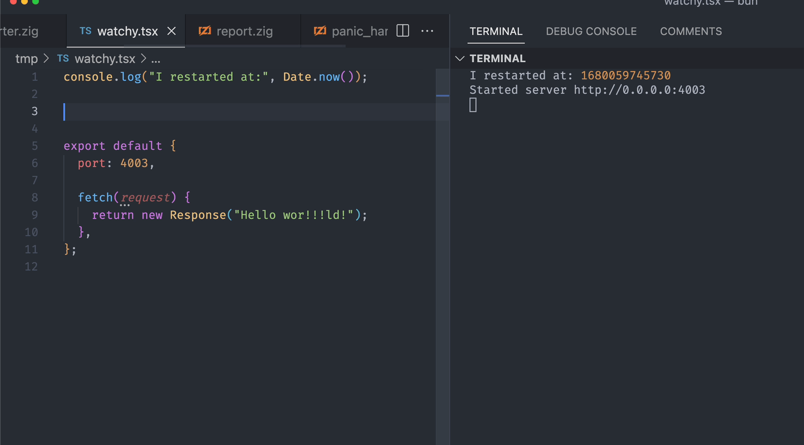
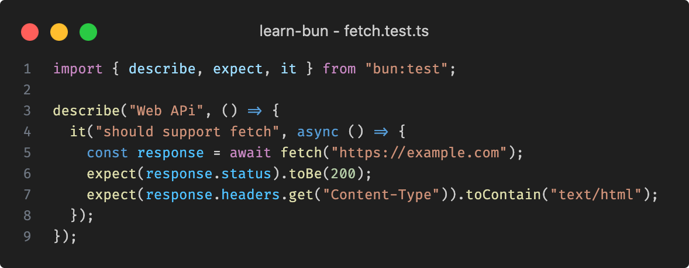
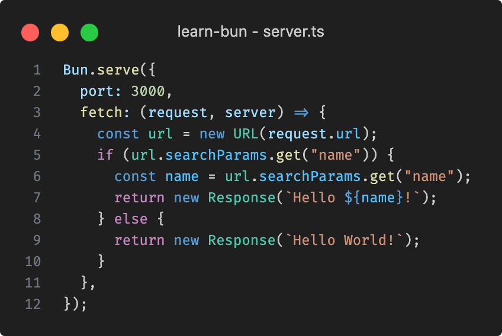

<h1 align="center">Learn Bun</h1>

_This github is just a note for personal learning based from youtube_

## Introduction

- Bun is a technology similar to NodeJS, is a tool that we can u to run **Javascript** code
- Bun created by Jarred Summer, as a **NodeJS** replacement
- Bun build using **Zig** programming language
- Bun build from _Webkit Javascript Core_, not like **NodeJs** which used V8
- Bun is a free & open source technology, so we can use it freely or contribute on
- [https://bun.sh](https://bun.sh)

## Why Bun

- Why do we learn bun, does nodejs not enough?
- Bun claimed that he is faster than **NodeJs**
- Also **Bun** can be used on **Javascript**, and as a default **Bun** can be used on **Typescript**
- Bun is not just a tool for running **Javascript** or **Typescript**, unlike **NodeJs**, on **Bun** every tool already provided, like Runtime for running **Javascript** / **Typescript**, Test runner for unit testing, and package manager that compatible with **Node Package Manager**

## Benchmark Bun vs Deno vs NodeJS


## Install Bun

- Bun can be installed on Linux, MacOS & Windows
- To check that Bun was installed successfully, open a new terminal window and run bun --version.

```sh
bun --version
```

- [Check detail for Installing bun](https://bun.sh/docs/installation)

## Create a Project

- Lets create a folder called learn-bun, get in the folder and use terminal to type

```sh
bun init
```

- When we are creating a project, we provided languages that we can choose

## Run file

- Use `bun run` to execute a source file.

```sh
bun run yourfilename.js/ts
```

## Typescript

- As i mentioned earlier, Bun support **Typescript** as a default
- If we take a look on a `jsconfig.json`, it is actually contain **Typescript** configuration, we can rename it into `tsconfig.json` if we want to use **Typescript**
- Is that easy
- Besides that, **Typescript** dependency will be installed by default on a **Bun** project
- In other word, we can easily switch language either **Javascript** or **Typescript**

## JSX

- Bun supports .jsx and .tsx files out of the box
- Bun's internal transpiler converts JSX syntax into vanilla JavaScript before execution.
- But we need to install react dependency

```sh
bun add react
bun add @types/react --dev
```

- [Read more detail about bun jsx here](https://bun.sh/docs/runtime/jsx)

## Environment Variable

- As a default bun will read .env file
- Bun automatically read .env file without any additional library

  

  ### Read environment variable

  - The current environment variables can be accessed via process.env.

  ```sh
  process.env.DATABASE_HOST; // => "localhost"
  ```

  - Bun also exposes these variables via Bun.env and import.meta.env, which is a simple alias of process.env.

  ```sh
  Bun.env.DATABASE_HOST; // => "localhost"
  import.meta.env.DATABASE_HOST; // => "localhost"
  ```

  - To print all currently-set environment variables to the command line, run bun --print process.env.

  ```sh
  bun --print process.env
  ```

  ### NODE_ENV

  - When we build a project, we need a different `.env` file such as development or production
  - Bun can read .env file based on NODE_ENV variable

  ```sh
  export NODE_ENV=production // this command normally used by MacOS or Linux

  set NODE_ENV=production // for windows
  ```

  - Create a file .env.production then add some variables
  - Run `bun env.ts` command
  - Bun will show your .env file, but once your change the NODE_ENV variable it will read the value then give what inside .env.production file

    

## Watch Mode

- Bun supports two kinds of automatic reloading via CLI flags:

  - `--watch` mode, which hard restarts Bun's process when imported files change.
  - `--hot` mode, which soft reloads the code (without restarting the process) when imported files change.

- Watch mode can be used with bun test or when running TypeScript, JSX, and JavaScript files.
- To run a file in --watch mode:

```sh
bun --watch index.tsx
```

- To run your tests in --watch mode:

```sh
bun --watch test
```

- In `--watch` mode, Bun keeps track of all imported files and watches them for changes
- If Bun crashes, `--watch` will attempt to automatically restart the process.



## Package Manager

### Install

- For installing dependency, we will use command:

```sh
bun install
```

- Similar when you used `npm install`
- All of the information dependency that have installed will be stored on a `package.log` file, But **Bun** hits different
- **Bun** stores dependency information on a `bun.lockb` (binary file) file
- **Bun** is using Binary file so it will be faster over **NPM** that use JSON file
- If you want to install production dependency only, you can use command:

```sh
bun install --production
```

### Management Dependency

- For adding dependency, use:

```sh
bun add dependency-name
```

- For removing dependency, use:

```sh
bun remove dependency-name
```

- For updating dependency, use:

```sh
bun update dependency-name
```

## Cache

- Once installing dependency, as a default generally dependency will be stored on `$USER/.bun/install/cache` computer local storage
- Because of that, if the dependency with the same version have been downloaded, it will be used, This behavior will speed up downloading process, instead of has to download one by one over and over

## Test Runner

- Bun ships with a fast, built-in, Jest-compatible test runner.
- The runner recursively searches the working directory for files that match the following patterns:

  - `\*.test.{js|jsx|ts|tsx}`
  - `\*\_test.{js|jsx|ts|tsx}`
  - `\*.spec.{js|jsx|ts|tsx}`
  - `\*\_spec.{js|jsx|ts|tsx}`

```sh
bun test
```

```ts
import { expect, test } from "bun:test";

test("2 + 2", () => {
  expect(2 + 2).toBe(4);
});
```

### Watch mode

- Similar to bun run, you can pass the `--watch` flag to bun test to watch for changes and re-run tests.

```sh
bun test --watch
```

### Timeouts

- Use the `--timeout` flag to specify a per-test timeout in milliseconds.
- If a test times out, it will be marked as failed. The default value is **5000**.

```sh
# default value is 5000
bun test --timeout 20
```

### Rerun tests

- Use the `--rerun-each` flag to run each test multiple times.
- This is useful for detecting flaky or non-deterministic test failures.

```sh
bun test --rerun-each 1000
```

## Package Runner

- On NPM, there is a `npx` file as a package runner, for running command that available in dependency, as a example we often use command `npx prisma generate`
- On Bun, we will be use `bunx`
- Command that can be executed by package runner can be check on folder `node_modules/.bin`

  

## Workspace

- Bun supports workspaces in package.json
- Workspaces make it easy to develop complex software as a monorepo consisting of several independent packages.
- This feature is used to create a management some projects at once on a one repository
- For example, within a project we have created, we want to add sub-project or module in package form again, so we can use this `workspace` feature
- To tell to main project, we could add workspace inside `package.json`
- We need to store all the sub-package within packages folder

  

```
tree
<root>
├── README.md
├── bun.lockb
├── package.json
├── tsconfig.json
└── packages
    ├── address
    │   ├── index.ts
    │   ├── package.json
    │   └── tsconfig.json
    ├── contact
    │   ├── index.ts
    │   ├── package.json
    │   └── tsconfig.json
    └── user
        ├── index.ts
        ├── package.json
        └── tsconfig.json
```

- After we added sub-package, we can install all of the sub-packages into `node_modules` with following command `bun install`
- Then you will be your sub-packages are on `node_modules` symlink that refers to your sub-package

## Bunfig

- Bun's behavior can be configured using its configuration file, `bunfig.toml`.
- In general, configuration can be done on `package.json` or `tsconfig.json`
- But somehow, we need to change the rule that can be done on `node` and it just Bun-specific things like test runner
- [Check this one for more specific](https://bun.sh/docs/runtime/bunfig)

### Test runner - Bunfig

- The test runner is configured under the `[test]` section of your bunfig.toml.

```sh
[test]
# configuration goes here
```

- The root directory to run tests from. Default ..

```sh
[test]
root = "./__tests__"
```

- Enables coverage reporting. Default false. Use `--coverage` to override.

```sh
[test]
root = "./__tests__"
coverage = true
```

## NodeJS Compatibility

- Bun aims for complete Node.js API compatibility.
- Even tho hasn`t been 100% yet...
- We can check which NodeJS library that has been compatible with `Bun` through [this link](https://bun.sh/docs/runtime/nodejs-apis)

## Web API

- We know that when using JavaScript in a Web Browser, there are Web API features that are usually only available in a Web Browser
- Because Bun will run on the Server, not in the Web Browser, so some features in the Web API may not be relevant for Bun
- However, Bun supports some of the features found in the Web API, so we can run Web API code with Bun
- [https://bun.sh/docs/runtime/web-apis](https://bun.sh/docs/runtime/web-apis)

  

- Fetch using `Bun`

## Bun Standard Library

- Apart from being compatible with the NodeJS Standard Library
- Bun also provides a Standard Library that we can use
- However, please note, when we use the Bun Standard Library, this means that this code will not run on NodeJS, because it is only available on Bun

## HTTP Server

- `Bun` provided library for creating HTTP Server
- To start a high-performance HTTP server with a clean API, the recommended approach is `Bun.serve`.
- Start an HTTP server in Bun with `Bun.serve`.
- [https://bun.sh/docs/api/http](https://bun.sh/docs/api/http)



## File IO

- `Bun` provides a set of optimized APIs for reading and writing files.

### Reading files (Bun.file())

```ts
const foo = Bun.file("foo.txt"); // relative to cwd
foo.size; // number of bytes
foo.type; // MIME type
```

### Writing files (Bun.write())

```ts
const data = `It was the best of times, it was the worst of times.`;
await Bun.write("output.txt", data);
```

## Hashing

- Bun provides a library for hashing
- Bun provides the bcrypt algorithm, which is widely used for hashing passwords

```ts
const password = "super-secure-pa$$word";

// use argon2 (default)
const argonHash = await Bun.password.hash(password, {
  algorithm: "argon2id", // "argon2id" | "argon2i" | "argon2d" | "bcrypt"
  memoryCost: 4, // memory usage in kibibytes
  timeCost: 3, // the number of iterations
});

// use bcrypt
const bcryptHash = await Bun.password.hash(password, {
  algorithm: "bcrypt",
  cost: 4, // number between 4-31
});
```

- The verify function automatically detects the algorithm based on the input hash and use the correct verification method

```ts
const password = "super-secure-pa$$word";

const hash = await Bun.password.hash(password, {
  /* config */
});

const isMatch = await Bun.password.verify(password, hash);
// => true
```

## Semantic Versioning

- `Bun` implements a semantic versioning API which can be used to compare versions and determine if a version is compatible with another range of versions.
- The versions and ranges are designed to be compatible with node-semver, which is used by npm clients.
- If you haven`t known yet about Semantic Versioning, [read this one](https://semver.org/)

```ts
import { semver } from "bun";

semver.satisfies("1.0.0", "^1.0.0"); // true
semver.satisfies("1.0.0", "^1.0.1"); // false
semver.satisfies("1.0.0", "~1.0.0"); // true
semver.satisfies("1.0.0", "~1.0.1"); // false
semver.satisfies("1.0.0", "1.0.0"); // true
semver.satisfies("1.0.0", "1.0.1"); // false
semver.satisfies("1.0.1", "1.0.0"); // false
semver.satisfies("1.0.0", "1.0.x"); // true
semver.satisfies("1.0.0", "1.x.x"); // true
semver.satisfies("1.0.0", "x.x.x"); // true
semver.satisfies("1.0.0", "1.0.0 - 2.0.0"); // true
semver.satisfies("1.0.0", "1.0.0 - 1.0.1"); // true
```

## Utilities

- Previously we have seen that we were using Bun library, we always used Bun global library
- There are a bunch of Bun global variables
- We can take a look on the documentation
- [https://bun.sh/docs/api/utils](https://bun.sh/docs/api/utils)

```ts
Bun.version;
// => "0.6.4"

Bun.main;
// /path/to/script.ts

console.log("hello");
await Bun.sleep(1000);
console.log("hello one second later!");
```

## Bun ecosystem

- One of the questions when we move from NodeJS to Bun is usually, what about the Bun ecosystem?
- Certainly the answer is no, because this technology is newer compared to the old NodeJS
- However, from the start Bun wanted to compatible with NodeJS, therefore there are a lot of library or package that NodeJS created can be used on Bun too.
- Lets trying to build web server with ExpressJS and Bun

  - Express and other major Node.js HTTP libraries should work out of the box
  - To install the ExpressJS library we can use the command:

  ```sh
  bun add express
  bun add @types/express --dev
  ```

  - To define a simple HTTP route and start a server with Express:

  ```ts
  import express from "express";

  const app = express();
  const port = 8080;

  app.get("/", (req, res) => {
    res.send("Hello World!");
  });

  app.listen(port, () => {
    console.log(`Listening on port ${port}...`);
  });
  ```

  - To start the server on localhost:

  ```sh
  bun server.ts
  ```

## Bun build

- Bun has a feature that we can use for doing building project, we can use command:

```sh
bun build input.js/ts --outdir folder
```

- Bun will automatically compile all the code we use into a single file
- Lets build this code:

```ts
import { sayHello } from "./src/hello";

const hello = sayHello("Ridlo");
console.log("🚀 ~ hello:", hello);
```

- This is the build result on a dist folder

```js
// src/hello.ts
function sayHello(name) {
  return `Hello ${name}!`;
}

// hello.ts
var hello2 = sayHello("Ridlo");
console.log("\uD83D\uDE80 ~ hello:", hello2);
```

```
You can do `bun build --help` to get more build feature
```


## Executable File

- Apart from creating single files, Bun can also be used to create executable files from the program code that we create
- We only need to add the --compile parameter when building
  Automatically all the packages we need will be included in the executable file, as well as the Bun Runtime
- It is recommended to add the --minify parameter to reduce the file size and thus speed up the application process
- And the --sourcemap parameter makes program code information available, making it easy to debug when an error occurs
- And for --compile, we can't use --outdir, we have to use --outfile
- Lets have a example with this pieces of code

```ts
import express from "express";

const app = express();

app.get("/", (req, res) => {
  const name = req.query["name"] || "world";
  res.send(`Hello ${name}!`);
});

app.listen(3200, () =>
  console.info(`Server is running on http://localhost:3200`)
);
```

- code command:

```sh
bun build express.ts --compile --minify --sourcemap --outfile dist/express
```

- `--compile`: Will generate a standalone Bun executable containing your bundled code
- `--minify`: Will enable all minification flags
- `--outfile`: Will write to a file and `dist/express` will be the destination

  

- You won`t be able to see because that is binary file and the size should be huge around megabite
- Simply command `dist/express` to execute the file

```sh
dist/express # For MacOs/linux
exe dist/express # For Windows
```
